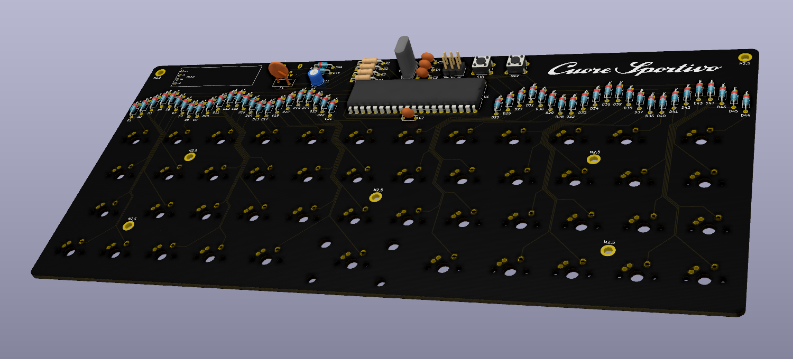

# Giulia
### 40% keyboard project

This will hopefully one day be a complete keyboard.  
Software side is USBaspLoader into QMK  
Inspired by coseyfannitutti's through-hole kits, but with some changes:
- Unistagger layout (like UT47)
- No sandwich, just PCB tray-mounted in a 3D printed lowpro case
- Despite being 40%, uses a "big" ATMega32A controller in DIP
- RGB underglow
- OLED to be admired by non-keeb people and possibly be useful for _stuff_

#### Credit/libraries used:
[Digikey](https://github.com/Digi-Key/digikey-kicad-library) - Molex USB connector  
[foostan](https://github.com/foostan/kbd) - OLED  
[ai03](https://github.com/ai03-2725/MX_Alps_Hybrid) - MX/ALPS switch  
